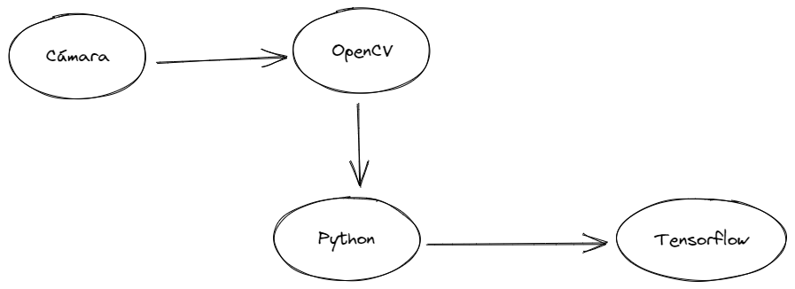

# Lector de Números ReTrash
Este programa consiste en el uso de una cámara e inteligencia artificial para leer un número.

En general, el programa se aprovecha de los siguientes elementos:

Más específicamente se realizan las siguientes acciones:
1. Tomar video de cámara con OpenCV.
2. Agregar un cuadrado en el centro de la pantalla.
3. Mostrar una pantalla con lo que se encuentra grabando.
4. Esperar a que se presione la tecla "s".
5. Capturar lo que se encuentra dentro del cuadrado.
6. Convertirlo en blanco y negro.
7. Reducir el tamaño de la imagen a 28x28.
8. Enviar la imagen obtenida al modelo de Tensorflow.
9. Mostrar la respuesta del modelo por consola.